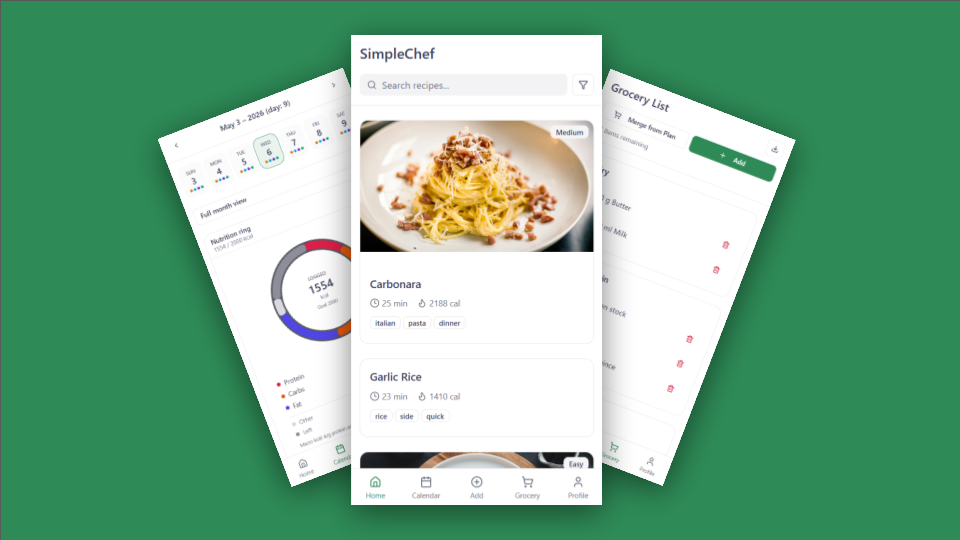

<p align="center">
  
</p>

<h1 align="center">SimpleChef</h1>

<p align="center">
  
</p>

<p align="center">
  <a href="https://simple-chef.vercel.app"><strong>simple-chef.vercel.app</strong></a>
</p>

SimpleChef is a cooking assistant that combines recipe management, step-by-step cooking, meal planning, and grocery list generation in one system.

This repository is an **academic course project** for **CS4063 Human–Computer Interaction** (Spring 2026). It is a prototype for learning and evaluation, not a commercial product or medical/nutritional advice.

**Code review submission:** the course expects a **public** GitHub repository (or an uploaded archive) with a README that explains structure, components, libraries, and how to run the project; see `docs/Assignments/Code Review/instructions.md`. Use this repo’s URL plus the live demo link above when submitting.

## Repository overview

- `backend/`: FastAPI service, database models, migrations, and seed scripts.
- `figma_design/`: Primary frontend for this deliverable (React + Vite web app).
- `frontend/`: Legacy Expo prototype (kept for reference); optional run notes in `frontend/README.md`.
- `docs/`: Architecture, API notes, requirements traceability, and assignment deliverables.
- `figs/`: README and presentation screenshots (for example `splash.png`).

### Module layout (for reviewers)

- **Backend:** `backend/app/api/api_v1/endpoints/` (HTTP routes), `backend/app/crud/` (persistence helpers), `backend/app/models/` (SQLAlchemy), `backend/app/schemas/` (Pydantic), `backend/app/services/` (domain logic), `backend/app/core/` (config, security). Integration tests live under `backend/tests/`.
- **Web app (`figma_design/`):** `src/app/` (routes and pages), `src/controllers/` (screen orchestration hooks), `src/lib/` (API client and shared utilities).

## Major components

- **Authentication:** JWT login/signup, protected endpoints, client session handling.
- **Recipe library:** create/edit/delete recipes, visibility rules, tags, filtering, detail pages.
- **Cooking mode:** step navigation, timer dock, ingredient-step linkage, keep-screen-on preference.
- **Meal planner:** month view, add meals by date/type, daily calorie summary.
- **Grocery list:** merge ingredients from plan, categorize, check/delete items, export/share.
- **Profile/settings:** calorie goal, dietary restrictions, and cooking preferences.

## Frameworks and libraries

### Backend
- **FastAPI** for API routing and request handling.
- **SQLAlchemy** + **Alembic** for ORM and database migrations.
- **PostgreSQL** (Docker Compose) for persistence.
- **Pydantic** for schema validation.
- **JWT auth** + password hashing for authentication/security.

### Frontend (`figma_design/`) — primary UI
- **React** + **TypeScript** with **Vite**.
- **React Router** for routing.
- **Axios** for HTTP (`src/lib/api.ts`); screen logic in **`src/controllers/`** hooks.
- **Zustand** for client state (auth session, timers).

### Frontend (`frontend/`) — legacy Expo
- **React Native** + **Expo Router**, **React Native Paper**, **Axios** (`services/api.ts`), **Zustand** (`store/`). Same API base (`/api/v1`) as the web app.

## Setup and run

### Prerequisites
- **Docker Desktop**
- **Python 3.8+**
- **Node.js 18+** (recommended)

### 1) Start backend
From the project root:

```bash
docker compose up -d
cd backend
python -m venv venv
```

Activate the virtual environment:

```bash
.\venv\Scripts\activate
```

Install dependencies, configure env, migrate, and run:

```bash
pip install -r requirements.txt
```

Create `backend/.env` with:

```env
POSTGRES_USER=postgres
POSTGRES_PASSWORD=postgres
POSTGRES_SERVER=localhost
POSTGRES_PORT=5432
POSTGRES_DB=simplechef
SECRET_KEY=change-me
ACCESS_TOKEN_EXPIRE_MINUTES=10080
```

Then run:

```bash
alembic upgrade head
python run.py
```

Backend URLs:
- API: `http://localhost:8000/api/v1`
- OpenAPI docs: `http://localhost:8000/docs`

### 2) Start frontend (`figma_design`)
In a new terminal:

```bash
cd figma_design
npm install
```

Create `figma_design/.env`:

```env
VITE_API_URL=http://127.0.0.1:8000/api/v1
```

Run the frontend:

```bash
npm run dev
```

## Testing and demo data

From `backend/`:

```bash
pytest tests/
python -m scripts.seed_demo
```

Seed script creates a demo account:
- Email: `demo@simplechef.local`
- Password: `demo12345`

## Screenshots

Store presentation images in `figs/` (used in this README for the splash banner) or in `docs/assets/` next to the vector logo. Embed each with Markdown image syntax, for example ``.

## Known limitations

- Recipe parsing is demo-only (no production LLM pipeline).
- URL-only parse input is intentionally rejected.
- Friends/social features are out of scope for this build.
- `frontend/` is a legacy prototype and not the primary deliverable UI.

## License

This project is released under the [MIT License](LICENSE).

## Documentation index

- `docs/API.md`: endpoint behavior and API conventions.
- `docs/ARCHITECTURE.md`: system architecture and data flow.
- `docs/REQUIREMENTS_TRACEABILITY.md`: requirement-to-implementation mapping.
- `docs/FIGMA_UI_SYSTEM_REQUIREMENTS.md`: UI/system requirements for design alignment.
- `docs/CONTINUATION_CHECKLIST.md`: deferred work and backlog notes.
