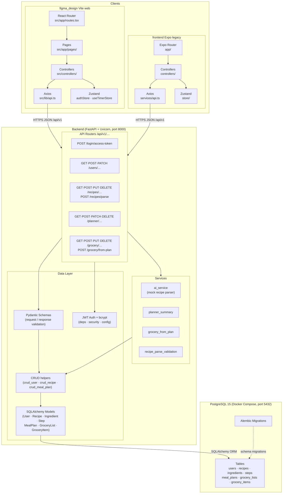
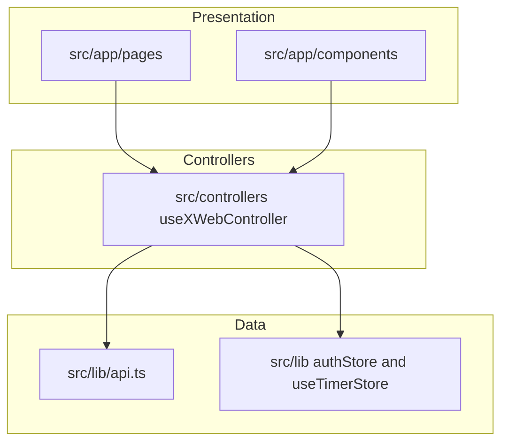
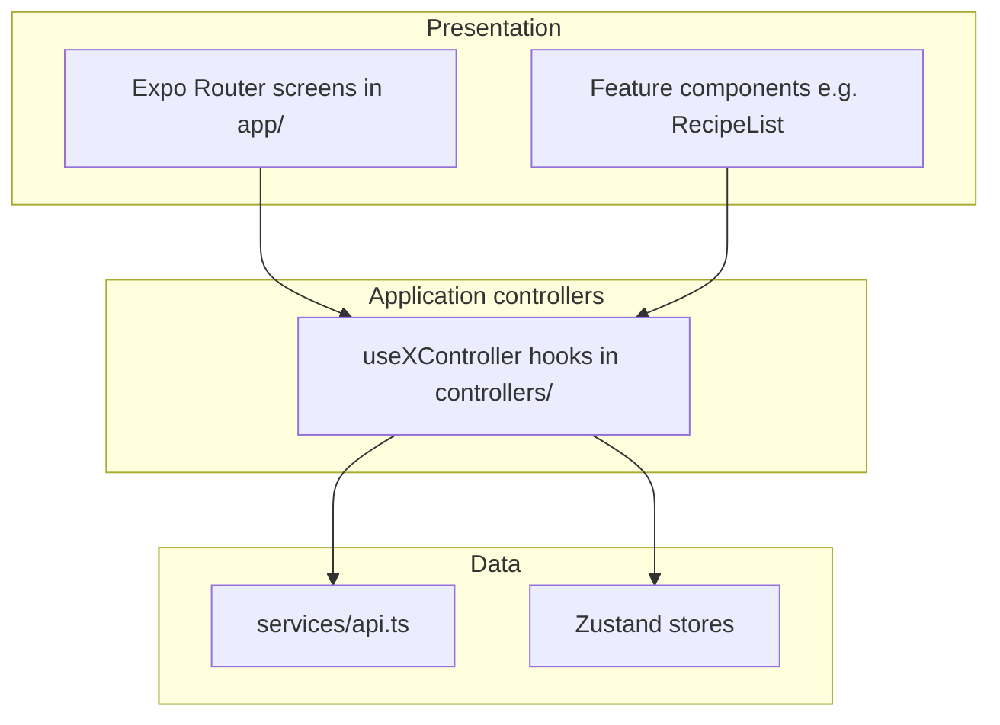

# SimpleChef - System Architecture

The repo ships **two** browser/mobile clients against one FastAPI backend. **`figma_design/`** is the primary web UI for the current course deliverable; **`frontend/`** at the repo root is a legacy **Expo** app that uses the same `/api/v1` contract.

## 1. Architectural Patterns
The system follows a **Client-Server** architecture with a **Layered** approach to ensure high cohesion and low coupling.

- **Primary web client:** React + Vite (`figma_design/`), talks to FastAPI over JSON.
- **Legacy mobile client:** React Native + Expo (`frontend/`), same API contract.
- **Backend:** FastAPI + SQLAlchemy + Alembic.
- **Database:** PostgreSQL (Docker Compose in dev).

## 2. Tech Stack

### Web client (`figma_design/`)
- **React 18**, **TypeScript**, **Vite**, **React Router 7**.
- **Axios** (`src/lib/api.ts`) with JWT on the `Authorization` header; **401** clears auth in the web store.
- **Zustand** for auth token and cooking timers.
- **UI:** app-local components under `src/app/components/` (incl. `ui/` primitives) plus page-level composition in `src/app/pages/`.

### Expo client (`frontend/`, legacy)
- **Expo Router**, **React Native Paper**, **Axios** (`services/api.ts`), **Zustand** (`store/`).
- **Controllers** (`controllers/`) mirror the web pattern: screens stay thin.

### Backend (`backend/`)
- **FastAPI**, **SQLAlchemy** ORM, **Pydantic v2** schemas, **Alembic** migrations, **JWT** (python-jose) + **bcrypt** (passlib).
- **Recipe parse:** demo `ai_service` + `recipe_parse_validation` — not a production LLM pipeline.

### Infrastructure
- **Docker Compose** for PostgreSQL (see repo `docker-compose.yml`).
- **User media:** recipe `image_url` is a string field; no bundled object storage in this repo.

## 3. System Modules (Separation of Concerns)

### 3.1. Web frontend modules (`figma_design/src/`)
- **`app/pages/`**: Route-level screens.
- **`app/components/`**: Shared UI (including `CookingTimerDock`, `RecipeCard`, `ui/`).
- **`controllers/`**: `use*WebController` hooks — data loading, forms, navigation side effects.
- **`lib/`**: `api.ts` (Axios client), `dto.ts`, `authStore`, `useTimerStore`.

### 3.2. Expo frontend modules (`frontend/`)
- **`app/`**: Expo Router routes.
- **`features/`**, **`components/`**: UI composition.
- **`controllers/`**: `use*Controller` hooks (same layering idea as web).
- **`services/api.ts`**, **`store/`**, **`types/`**.

### 3.3. Backend modules (`backend/app/`)
- **`api/api_v1/endpoints/`**: FastAPI routers (`login`, `users`, `recipes`, `planner`, `grocery`).
- **`crud/`**: Database access helpers (`crud_user`, `crud_recipe`, `crud_meal_plan`, etc.).
- **`services/`**: Focused helpers (e.g. `grocery_from_plan`, `planner_summary`, `ai_service`, `recipe_parse_validation`) — not a separate “service class per domain” framework.
- **`models/`**, **`schemas/`**, **`core/`** (settings, security), **`db/`** (session).

## 4. Data Flow (as implemented)
1. **Auth:** `POST /users/` registers; `POST /login/access-token` returns JWT; clients attach `Bearer` on subsequent calls.
2. **Recipes:** CRUD via `/recipes/`; optional `POST /recipes/parse` returns a **draft** `RecipeCreate` from plain text (demo). Client edits and `POST /recipes/` to persist.
3. **Planner:** Meals stored in `meal_plans`; grocery merge reads plans in a date range and aggregates ingredients — there is no automatic DB trigger from planner to grocery; merge is explicit (`POST /grocery/from-plan`).
4. **Cooking:** Step index and timers are **client-side** (Zustand); the backend stores recipe shape (`steps`, `ingredient.step_id`).

## 5. ERD (Entity Relationship Diagram) Concept
- **User** (1) → (N) **Recipe** (`created_by_id`)
- **User** (1) → (N) **MealPlan**
- **Recipe** (0..1) ← (N) **MealPlan** (optional `recipe_id`; many meals may reference the same recipe)
- **Recipe** (1) → (N) **Ingredient**, (1) → (N) **Step**
- **User** (1) → (1) **GroceryList**
- **GroceryList** (1) → (N) **GroceryItem**

## 6. API authorization (ownership pattern)

All mutating endpoints must verify the authenticated user owns the resource (or the resource is scoped to them via a parent row).

- **Recipes**
  - `GET /recipes/` returns recipes where `created_by_id == current_user.id` **or** `is_public` is true.
  - `GET /recipes/{id}` returns **404** if the recipe is neither owned by the user nor public (avoid existence leaks).
  - `POST /recipes/` sets `created_by_id` to the current user; optional `is_public` on the body is honored.
  - `PUT` / `DELETE /recipes/{id}` require `created_by_id == current_user.id`; otherwise **403**.
  - Legacy rows with `created_by_id` null are migrated to `is_public = true` so existing demo data stays visible.

- **Grocery items**
  - `PUT /grocery/items/{id}` loads the item by joining `GroceryItem` → `GroceryList` and filtering `GroceryList.user_id == current_user.id`. Other users get **404** (same shape as “not found”).

**Pattern for new endpoints:** join from the row being updated/deleted up to `user_id` (or equivalent) and compare to `current_user.id` before applying changes. Prefer **404** over **403** for cross-tenant id guesses when the UX should not reveal whether a row exists.

## 7. Cooking data model (mise en place)

- `Ingredient` may reference `Step` via nullable `step_id` (FK). Clients send `step_order_index` on create/update; the API resolves it to `step_id` after steps are persisted.
- **Display rules (app):** ingredients with no `step_id` appear in mise on **step 1 only** (global prep). Ingredients linked to the current step appear for that step.

## 8. Grocery merge from meal plan

- `POST /grocery/from-plan` loads `MealPlan` rows for the user in `[start_date, end_date]` with a `recipe_id`, expands each recipe’s ingredients, aggregates by normalized `(name, unit)`, sums quantities, assigns a default category from keywords, then **merges** into the user’s `GroceryItem` rows (add quantity when the key exists, else insert). Manual-only lines are untouched unless they share the same normalized key.

## 9. Frontend layering

### 9.1 Web (`figma_design/`)

- **Pages** stay mostly declarative; **controllers** own fetches, derived state, and navigation.
- **Data** layer: Axios instance + Zustand for token and timers.

### 9.2 Expo (`frontend/`)

- **Presentation** (`app/`, `features/`): layout, Paper components, accessibility labels; routes call controllers rather than inlining all API logic.
- **Application** (`controllers/`): per-screen state, debouncing, modals, and async actions.
- **Data** (`services/api.ts`, `store/`): HTTP, auth header, 401 handling; global token and timers.

**Documentation links**

- UI / Figma single source: [FIGMA_UI_SYSTEM_REQUIREMENTS.md](./FIGMA_UI_SYSTEM_REQUIREMENTS.md)
- SRS/proposal ↔ API matrix: [REQUIREMENTS_TRACEABILITY.md](./REQUIREMENTS_TRACEABILITY.md)
- Backend maintainability backlog (document-only): [BACKEND_REFINEMENT_NOTES.md](./BACKEND_REFINEMENT_NOTES.md)

## 10. Known backend improvements

See [BACKEND_REFINEMENT_NOTES.md](./BACKEND_REFINEMENT_NOTES.md) for suggested refactors (service extraction, test gaps, validation boundaries) tracked without blocking feature work.
