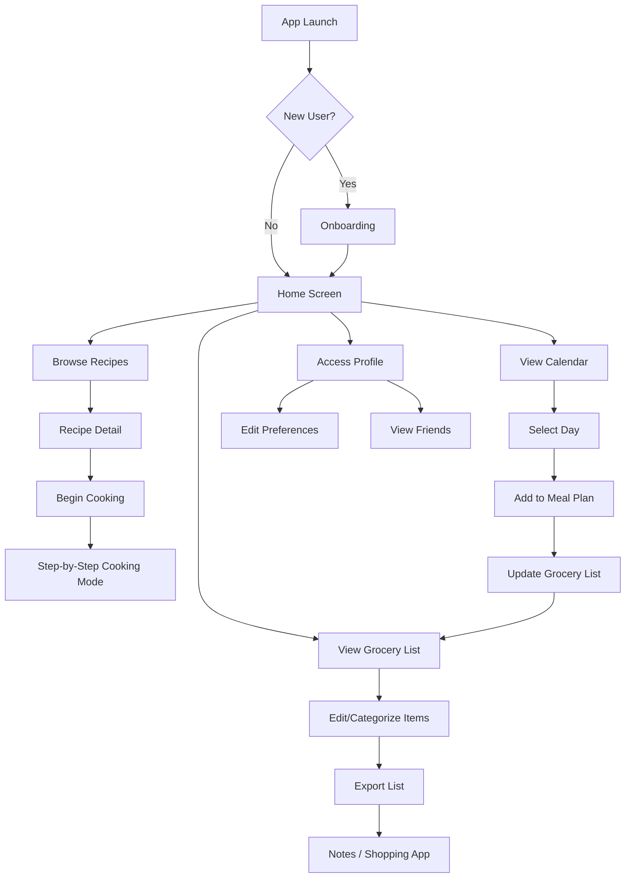
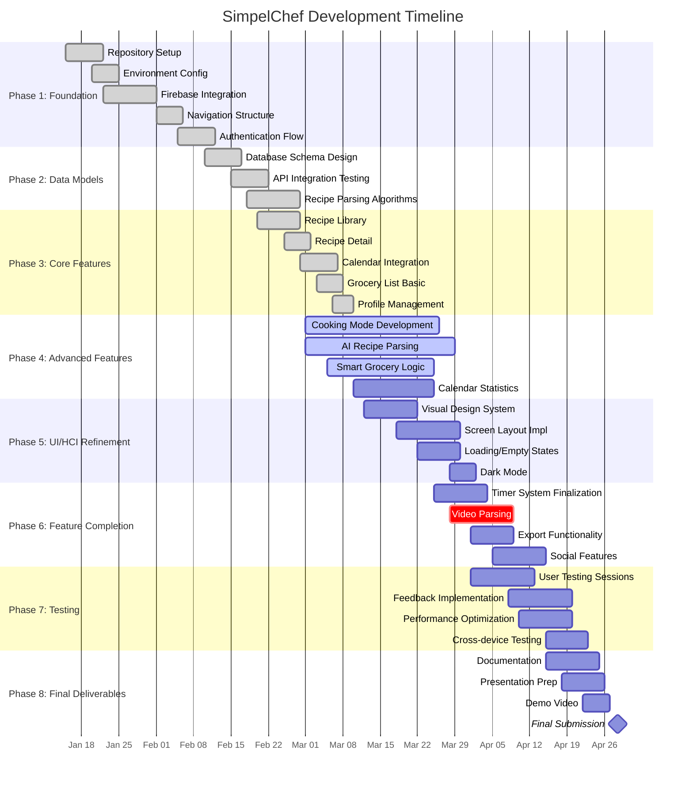

Below are the Mermaid diagrams for the User Flow and Gantt Chart. You can render these using the [Mermaid Live Editor](https://mermaid.live/) or integrate them into your LaTeX document using the `mermaid` package (if supported) or by exporting as images.

---

### Figure 8: User Flow Diagram (Mermaid)

---

### Figure 10: Gantt Chart (Mermaid)

---

### How to Use These in Your Report

1. **If using LaTeX with the `mermaid` package**:  
   Include `\usepackage{mermaid}` and then wrap the diagram in `\begin{mermaid}...\end{mermaid}`. You may need to enable shell-escape.

2. **If generating images externally**:  
   - Go to [Mermaid Live](https://mermaid.live/).  
   - Paste the code, adjust theme as needed, and export as PNG/SVG.  
   - Insert the image in your document with a caption.

3. **For the Gantt chart**, note that the `crit` tag highlights the video parsing task as delayed (shown in red). The current date (Mar 10) is not automatically marked, but you can add a vertical line in your image editor if needed.

These diagrams will give your progress report a professional, visually clear representation of your project’s workflow and timeline.